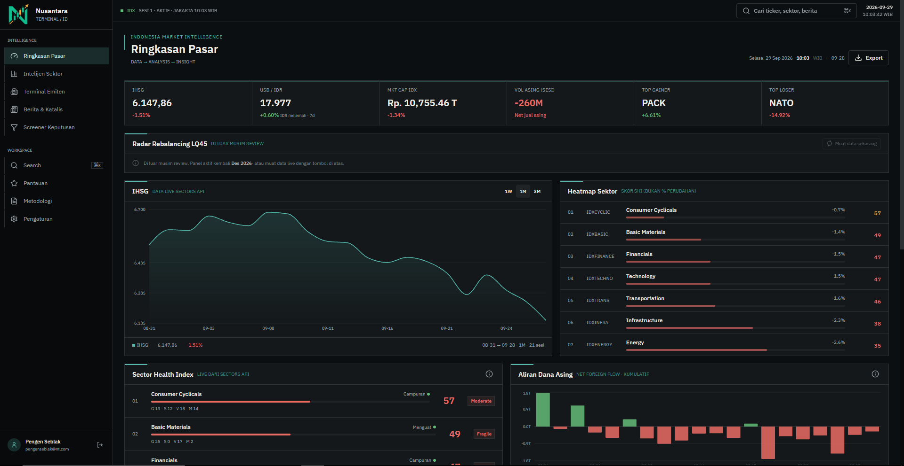

<p align="center">
  
</p>

<h1 align="center">PengenSeblak — Indonesian Market Terminal</h1>

<p align="center">
  A high-density, credit-aware market intelligence terminal for the <strong>Indonesian Stock Exchange (IDX)</strong>,<br/>
  built on the <a href="https://docs.sectors.app/get-started/v2/overview">Sectors REST API v2</a>.<br/>
  It turns raw market data into <strong>derived, explainable insights</strong> — sector health scores,<br/>
  anomaly detection, financial distress models, and a rule-based decision screener.
</p>

<p align="center">
  
</p>

> **Bahasa Indonesia** is the primary UI language, with standard English financial terms (P/E, ROE, free float, …) preserved where they aid professional use.

---

## Tech Stack

<!-- Centralized badge style: flat, no extra labels -->

| | Technology |
|---|---|
| **Language** |  |
| **Framework** |   |
| **Build** |  |
| **Styling** |    |
| **State / Data** |   |
| **Icons** |  |
| **Server** |  |
| **Database** |  |
| **Cache** |  |
| **Tunnel** |  |

---

## What it does

Every analytical number in the app is **computed from live API data** — no mock data in any user-facing page. Derived scores are always accompanied by a tooltip explaining how they are calculated, so nothing is a black box.

### Ringkasan Pasar — Market Overview
- IHSG price chart with 1W/1M/3M range filter, market-cap, and foreign-flow panels.
- **Net Foreign Flow** bar chart (daily buy/sell) from `/foreign-flow/IHSG/`.
- **Monitor Anomali Pasar** — scrollable live anomaly list from Z-score divergence detection.
- **Katalis Pasar Terbaru** — real IDX news feed, clickable into a full detail sheet.
- **Macro Pulse** — USD/IDR trend, market-cap, top movers, foreign volume.
- **Radar Rebalancing LQ45** — predicts inclusion/exclusion candidates at the next LQ45 review (seasonal: active Dec–Feb and Jun–Aug, with an off-season "load anyway" option).

### Intelijen Sektor — Sector Intelligence
- **Sector Health Index (SHI)** 0–100 with an explainable "why this score" breakdown (Pertumbuhan / Stabilitas / Valuasi / Momentum) from real subsector report inputs.
- Sector selector across verified sub-sectors; per-sector universe of emitens with price, P/E, ROE, DER, margin, market cap.
- **Pertumbuhan Historis** — revenue/earnings growth history with 3Y/5Y/8Y range filter.
- **Divergensi Sektor** — Z-score anomalies within the selected sub-sector.

### Terminal Emiten — Company & Peer Terminal
- Peer comparison of 2–5 emitens (search across top-50 IDX names by market cap, persisted to localStorage).
- **Matriks Komparasi** — fundamentals from live company reports, with Valuation Percentile Rank replacing decorative Free Float.
- **Dominance Score** — head-to-head market-leader matrix from a weighted fundamental composite. Individual peers can be removed (clears their client cache); "Hapus semua" clears the whole set.
- **Kesehatan & Distres** — **Piotroski F-Score** (0–9) and **Altman Z-Score** (incl. bank branch) with plain-language hover tooltips for every input metric, **plus a plain-language synthesis paragraph** explaining what the score means and what to watch.
- Revenue-segment breakdown (HHI concentration) per selected peer.

### Halaman Detail Emiten — `/emiten/{symbol}`
- Dedicated per-company analytics page (opened from global search, sector tables, or anomaly sheets).
- Metric strip (price, market cap, P/E, EPS, dividend yield, valuation percentile), Piotroski + Altman, historical P/E band, revenue segments, related anomalies, and news mentioning the ticker.
- **Watchlist star** — add/remove to the persisted watchlist straight from the page.

### Berita & Katalis — News Intelligence
- Real IDX news feed (50 latest articles) with search, sector/tag filters, and sentiment classification (Positive/Neutral/Negative derived from tags).
- **Indeks Ketakutan (Fear Index)** — rolling 20-session stdev of IHSG daily returns, with real news-sentiment distribution as proof factors.
- Sector and tag distribution sidebars (click-to-filter).
- Full news detail sheet with body, symbols, and source link.

### Screener Keputusan — Decision Screener
- Real screener rows (from the shared anomaly-scan queries — **zero extra API credits**), filtered by quality threshold, ROE minimum, classification, and flag toggles.
- **Deterministic decision labels**: *Undervalued Quality*, *Growth at Reasonable Price*, *Dividend Trap Alert*, *Balanced Fundamentals*.
- Multi-factor decision matrix, sortable columns, watchlist toggle per row.
- **Valuation Percentile Rank** table — replaces the old decorative ESG panel; ranks each emiten's P/E against its own history (0 extra credits, shared data).

### Daftar Pantauan — Watchlist
- Persisted (localStorage) watchlist with live price/change/P/E/ROE and anomaly tags.
- Research notes per emiten and price alerts (above/below thresholds).

### Metodologi — Methodology
- Full in-app documentation of every algorithm (SHI, Piotroski, Altman, Dominance, Divergence) and its data sources.

---

## Architecture

```
Browser (React 19 + Vite, port 8080)
  └── TanStack Query (client cache) ──► Express proxy (port 3001)
                                          ├── JWT auth (bcrypt + jsonwebtoken)
                                          ├── Rate limiting (express-rate-limit + Redis)
                                          ├── Endpoint registry + local validation
                                          ├── 6-layer credit defense (see below)
                                          └── Sectors API v2 (api.sectors.app)
```

**Client:** React 19 · TanStack Start/Router · TanStack Query · Recharts · Tailwind CSS 4 + shadcn/ui (Radix) · Zustand · Zod · Lucide icons

**Server:** Express 5 · ioredis · mysql2 · node-cron · helmet · morgan · @ngrok/ngrok

### Credit defense (6 layers)

The Sectors API charges per request, so the server stack is built to avoid wasted calls:

1. **Redis + file cache with per-endpoint TTL** — every endpoint has its own freshness window (see table below); stale data is served from cache until the TTL expires, then one fresh request refills it.
2. **TanStack Query client cache** — no refetch while data is fresh; query keys shared across pages so one fetch feeds every consumer.
3. **In-flight request dedup** — identical concurrent requests share one upstream call.
4. **Sections selector** — company reports request only needed sections (6 credits/symbol instead of 8).
5. **Cache-aware prefetch** on startup in development; morning warm-up cron before market open.
6. **Endpoint registry with local validation** — malformed requests are rejected before reaching the paid API.

#### Cache TTL by data category

How old data can get before a new API call is made — server-side (Redis/file) and client-side (TanStack Query):

| Data category | Server TTL | Client staleTime | Why |
|---|---|---|---|
| **Company reports** (overview, valuation, financials, dividend) | **24 hours** | 1 hour | Annual data — won't change intraday |
| **Sector reports** (growth, stability, valuation) | **6 hours** | 6 minutes | Recomputed daily, stable within a session |
| **Daily prices / IHSG index** | **15 min** during market hours, **24 h** after close | 15 minutes | Intraday during IDX hours (09:00–15:50 WIB), then frozen |
| **Foreign flow** (buy/sell per day) | **15 min** | 15 minutes | Moves intraday with market activity |
| **Broker activity** | **30 min** | — | Broker flows settle after each session |
| **News** | **5 min** | 5 minutes | Most volatile — new articles arrive continuously |
| **Corporate actions** | **1 hour** | — | Scheduled announcements, stable within the hour |
| **Suspensions** | **10 min** | — | Can happen at any time |
| **Static lists** (subsectors, tags, company list) | **7 days** | 7 days | Changes only with new listings/delistings |

> **Effect:** a full page reload during market hours costs ~0 credits if data was fetched within the last 5–15 minutes. A fresh morning visit costs ~20 credits total across all pages; subsequent navigation for the rest of the day is free.

---

## Getting started

### Prerequisites
- Node.js 18+
- MySQL and Redis (Redis optional — in-memory fallback for single instance)
- A [Sectors API](https://sectors.app) key

### Setup

```bash
git clone <repo> && cd PengenSeblak
npm install
cd server && npm install && cd ..
cp .example.env .env          # fill in the values (see below)
```

Create the database schema:

```bash
mysql -u <user> -p pengen_seblak < pengen_seblak.sql
```

### Environment variables (`.env`)

| Key | Purpose |
|---|---|
| `PORT` | Express port (default 3001) |
| `SECTORS_API_KEY` | Your Sectors API key — **required** |
| `SECTORS_API_BASE_URL` | Upstream base (default `https://api.sectors.app/v2`) |
| `DB_*` | MySQL connection (host/port/user/password/name) |
| `REDIS_URL` | Optional Redis; falls back to in-memory cache |
| `JWT_SECRET`, `COOKIE_SECRET` | Long random strings — **required in production** |
| `CLIENT_ORIGIN` | Comma-separated allowed browser origins |
| `NGROK_AUTHTOKEN`, `NGROK_URL` | Optional public tunnel config |
| `VITE_API_URL` | Leave **empty** in dev (Vite proxies `/api` to Express) |

### Run

```bash
npm run dev          # Vite (:8080) + Express (:3001) + ngrok tunnel, concurrently
npm run dev:server   # server only
npm run build        # production client build
```

Then open http://localhost:8080 and register an account.

---

## Project layout

```
src/
  components/terminal/   # page components (pages.tsx, charts, primitives, EmitenDetail)
  components/auth/       # login page
  hooks/                 # data hooks — one per API concern, credit-aware
  lib/algorithms/        # SHI, Piotroski, Altman, Dominance, Divergence, terminal metrics
  lib/                   # api client, query config (stale times), utils
  stores/                # Zustand: auth, watchlist
  routes/                # TanStack Router file routes
server/
  src/                   # Express app, adapters, endpoint registry, ngrok, prefetch
  migrations/            # SQL migrations
pengen_seblak.sql        # full database schema
```

---

## Roadmap

The current version is a working hackathon prototype. The following improvements are planned for post-hackathon development.

### 1. Centralized data warehouse

Migrate from on-demand API proxying to a **scheduled ETL pipeline** that pulls Sectors API data into MySQL on a fixed cadence, making the database the primary read path instead of the API:

- **Nightly batch** (02:00 WIB) — full company reports, sector reports, financial statements, and corporate actions for all ~960 IDX tickers, stored in normalized tables (`companies`, `financials_yearly`, `ratios_yearly`, `valuations_history`, `corporate_actions`).
- **Intraday polling** (every 15 min during market hours) — prices, foreign flow, and broker summary into `daily_prices`, `foreign_flow`, `broker_activity` tables.
- **News ingestion** (every 5 min) — IDX news stored with full-text search indexes, sentiment pre-computed and cached.
- **Benefit:** eliminates per-page API credit consumption; all client reads hit MySQL (free); the Sectors API budget covers only the nightly + intraday batch calls regardless of how many users browse.
- **Historical depth:** once the warehouse accumulates 1–5 years of data, time-series analytics (drawdown, Sharpe ratio, beta vs IHSG, seasonality) become pure SQL — no API needed.

### 2. PE Price Band visualization

Replace the plain-text valuation percentile with a **visual PE Price Band** (à la Stockbit) — a horizontal range showing the 5-year low / average / high PE with a marker for the current PE, so users instantly see where the stock sits relative to its own history. The data already exists in `historical_valuation`; only the chart rendering is needed.

### 3. Portfolio tracker

Extend the watchlist into a full portfolio with:
- Holdings (shares, buy price, buy date) per ticker.
- Unrealized P&L computed from live prices.
- Sector exposure breakdown and concentration risk alert.
- Dividend calendar from corporate actions data.

### 4. Technical analysis layer

Add a lightweight technical overlay (not a full charting platform):
- **RSI (14)** and **MACD** computed from the IHSG daily series already cached.
- **Support/resistance** from 52-week high/low.
- **Foreign flow trend** — 5-day moving average of net buy/sell per ticker.
- These are synthesized signals, not raw indicators — the app tells you "RSI 72 → overheated short-term" rather than just showing the number.

### 5. Alerting system

- **Price alerts** — push notification / email when a watchlist ticker crosses the user's threshold (already stored in the watchlist; just needs a background checker).
- **Anomaly alerts** — notify when a new divergence anomaly is detected for a watched ticker.
- **SHI change alerts** — notify when a sector's SHI score moves by more than ±10 points week-over-week.

### 6. Multi-market support

The Sectors API also covers **SGX** (Singapore) and **KLSE** (Malaysia). The architecture (endpoint registry, adapters, algorithms) is already market-agnostic — extending to these markets is primarily a routing + universe-expansion task.

### 7. Export & reporting

- **PDF research report** per emiten — one-page summary with all scores, valuation band, and synthesis text.
- **CSV export** of screener results with all columns.
- **Portfolio summary PDF** — holdings, P&L, sector allocation.

---

## Credits

Built by:

- **Anatasya Dwi Rima Rechiyono** — Frontend Developer & Designer
- **Rio Septianto** — Backend Developer

Market data by [Sectors API](https://sectors.app).

---

## Notes

- **Analysis, not advice** — every screen includes plain-language synthesis explaining what the numbers mean. The sidebar carries a persistent disclaimer: *"Alat analisis dan informasi pasar. Bukan rekomendasi investasi."*
- **No automated trading** — this is decision support only.
- **No fabricated data** — where an API field is missing, the UI shows "—" and says so, rather than inventing a number.
- Not officially affiliated with IDX or Sectors.app.
